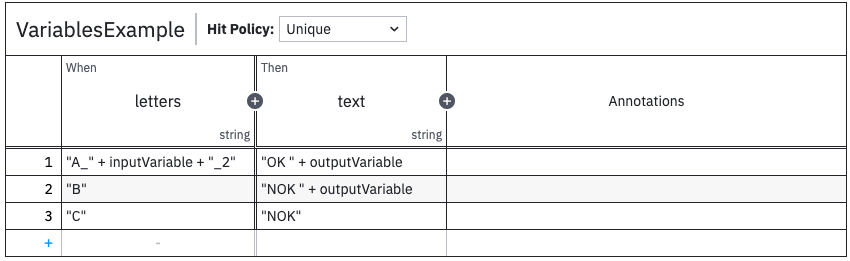

# DMN Tester

You can integrate the DMN Tester in your project pretty simple. 

## Why

The _DMN Tester_ lets you easily validate your DMNs, that you create or get from the business analysts.

The _DMN Tester_ gives you a UI, to configure a test for a DMN. 
As there is already some information in your domain model, we must only define the rest.
And so we can directly run the tests, without configure them manually in the UI.

See [Github](https://github.com/camunda-community-hub/camunda-dmn-tester) for more information
on what the _DMN Tester_ is all about.

## Get Started
The _DMN Tester DSL_ use the DMNs you created - in this context I refer to the [Bpmn DSL](../bpmnDsl.md#business-rule-tasks-decision-dmns)

Let's start with a basic example:
```scala
// put your dmns in the dmn package of your project (main)
package camundala.examples.invoice.dmn
// import the projects bpmns (DMNs)
import camundala.examples.invoice.bpmn.*
// import Camundala dmn DSL / the DMN Tester starter
import camundala.dmn.{DmnTesterConfigCreator, DmnTesterStarter}
// define an object that extends ..  
object ProjectDmnTester 
  extends DmnTesterConfigCreator, //  .. from a Config Creator DSL 
    DmnTesterStarter, // .. from a starter - that runs the DMN Tester automatically
    App: // .. to run the Application
      
      startDmnTester()

      createDmnConfigs(
          InvoiceAssignApproverDMN
            .testValues(_.amount, 249, 250, 999, 1000, 1001),
            .dmnPath("invoiceBusinessDecisions")
          // for demonstration - created unit test - acceptMissingRules just for demo
          InvoiceAssignApproverDmnUnit
            .acceptMissingRules
            .testUnit
            .dmnPath("invoiceBusinessDecisions")
            .inTestMode
        )

end ProjectDmnTester
```

### Run the DMN Tester
In your _sbt-console_:
 
  `runMain camundala.examples.invoice.dmn.ProjectDmnTester`

## startDmnTester
Starts the Docker container. 
This makes the whole process pretty nice and fast. 
The following steps are done:

- Check if the Container is already running.
- If so - it checks if it is running for this project.
- If it is running for another project - it stops the Container.
- If not - the Container is started.

## createDmnConfigs
A DSL to create the DMN Tester configurations.

You start from the DMN, that you defined, here an example:

```scala
  lazy val InvoiceAssignApproverDMN = collectEntries(
    decisionDefinitionKey = "example-invoice-c7-assignApprover",
    in = SelectApproverGroup(),
    out = Seq(ApproverGroup.management),
    descr = "Decision Table on who must approve the Invoice.",
  )
```

Now you can add the following:

### .testValues
Define the input values for the DMN you want to test. 

For the following types this is done automatically:

- `boolean` -> `true` & `false`
- `enum` -> all values of this enumeration.

If an input attribute is **optional** (_Option_) it also will have a _null_ as a test input.

That said, you only need to define the rest of your inputs, like

```scala
  InvoiceAssignApproverDMN
    .testValues(_.amount, 249, 250, 999, 1000, 1001)
```

It starts with the name of the input (`_.amount`) and is followed by all test values with the according type.

@:callout(info)
The underline in `_.amount` is the input of the DMN (_for the coder: it is a function:_ `In => DmnValueType`). 
This makes sure the compiler checks if there is such an attribute.

```log
[error] -- [E008] Not Found Error: /Users/mpa/dev/Github/pme123/camundala/examples/invoice/camunda7/src/main/scala/camundala/examples/invoice/dmn/InvoiceDmnTesterConfigCreator.scala:27:20 
[error] 27 |      .testValues(_.amounts, 249, 250, 999, 1000, 1001),
[error]    |                  ^^^^^^^^^
[error]    |value amounts is not a member of camundala.examples.invoice.domain.SelectApproverGroup - did you mean _$1.amount?
```
@:@

### .testUnit
By default, a DMN Test is integrated - meaning that it will take all dependent inputs into account.

So if you have complex set of dependent DMN Tables you can test them separately, like:
```scala
.testUnit
```

### .dmnPath
To support different naming schemes, you can adjust the DMN file name the following way:

- Nothing to do, if the file name is `dmnBasePath / s"${decisionId}.dmn"`. (see configuration)
- The creation of the default path can be overridden: 
    ```scala
      protected def defaultDmnPath(dmnName: String): os.Path =
        dmnBasePath / s"${dmnName.replace("myPrefix-", "")}.dmn"
    ```
- A different name, but with the same _defaultDmnPath_:
    ```scala
      .dmnPath("invoiceBusinessDecisions")
    ``` 
- An entirely different path (using _os.Path_):
    ```scala
      .dmnPath(os.pwd / "mySpecial.dmn")
    ``` 
  
### .acceptMissingRules
Sometimes you have a lot of rules that you don't want to test all.
Adding `.acceptMissingRules` will allow missing rules in your test.

### .inTestMode
When you validated a test result, you can create Test Cases.
If you do so, you must add `.inTestMode`, 
otherwise the configuration will be overridden, when running the DMN Tester the next time.

## Variables
If you have dynamic content in your DMN (input or output), you need to add them as well.

To distinguish them from testing inputs, we wrap them in a _DmnVariable_ class.

@:callout(info)
Camunda DMN Engine handles Variables and Test Inputs exactly the same.

We distinguish them, because Variables are not important for the matching process.
So we do not need to have different values for them.

We recommend not to use dynamic values in inputs of rules. 
If you do the variable will rather be a test input.

@:@

Example:

```scala
  case class Input(letters: String = "A_dynamic_2",
                   inputVariable: DmnVariable[String] = DmnVariable("dynamic"),
                   outputVariable: DmnVariable[String] = DmnVariable("dynamicOut")
                  )
```



In this example the input must be `A_dynamic_2` to match the first rule. 
So it is a corner case if this is rather a test input.

The output variable can be whatever you want.

## Configuration
The following is the default configuration:
```scala
case class DmnTesterStarterConfig(
         // the name of the container that will be started
         containerName: String = "camunda-dmn-tester",
         // path to where the configs should be created in
         dmnConfigPaths: Seq[os.Path] = Seq(
           projectBasePath / "src" / "it" / "resources" / "dmnConfigs"
         ),
         // paths where the DMNs are (could be different places)
         dmnPaths: Seq[os.Path] = Seq(
           projectBasePath / "src" / "main" / "resources"
         ),
         // the port the DMN Tester is started - e.g. http://localhost:8883
         exposedPort: Int = 8883,
         // the image version of the DMN Tester
         imageVersion: String = "latest"
 )
```

You can override it via the following variables (you see the defaults):

```scala
protected def starterConfig: DmnTesterStarterConfig = DmnTesterStarterConfig()
// this is the project where you start the DmnCreator
protected def projectBasePath: os.Path = os.pwd

// the path where the DMNs are
protected def dmnBasePath: os.Path = starterConfig.dmnPaths.head
// the path where the DMN Configs are
protected def dmnConfigPath: os.Path = starterConfig.dmnConfigPaths.head
// creating the Path to the DMN - by default the _dmnName_ is `decisionDmn.decisionDefinitionKey`.
protected def defaultDmnPath(dmnName: String): os.Path = dmnBasePath / s"$dmnName.dmn"

```

Example of a general Tester you can use for all project, that also starts the DMN Tester:

```scala
trait MyCompanyDmnTester extends DmnTesterConfigCreator, DmnTesterStarter:

  private def localDmnPath = os.pwd / diagramPath

  override protected def starterConfig: DmnTesterStarterConfig =
    DmnTesterStarterConfig(
      dmnPaths = Seq(localDmnPath)
  )
  override protected def defaultDmnPath(dmnName: String): os.Path =
    val dmnPath = dmnBasePath / s"${dmnName.replace("mycompany-", "")}.dmn"
    if(!dmnPath.toIO.exists())
      throw FileNotFoundException(s"There is no DMN in $dmnPath")
    dmnPath

  startDmnTester()

end MyCompanyDmnTester
```

So in the project you can focus on the creation of DMN Configurations, like:

```scala
// runMain mycompany.nnk.dmn.ProjectDmnTester
object ProjectDmnTester extends MyCompanyDmnTester, App:

  createDmnConfigs(
        ...
  )

end ProjectDmnTester
```

## Problem Handling

The DMN Tester is run on Docker.
So to find problems, you have:

- For the server: the Docker Console
- For the client: the Browser Console

If you are stuck, or find a problem, please create an issue on Github.


