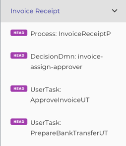
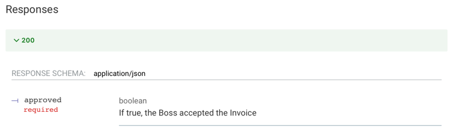
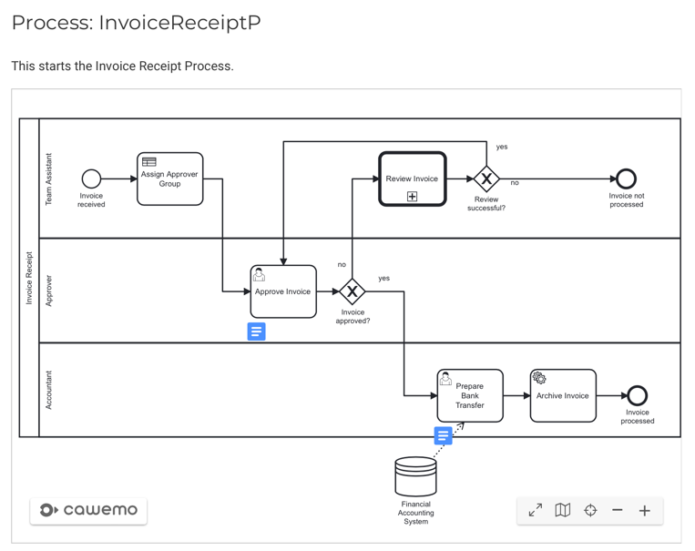

# API Documentation

@:callout(info)
The focus is to describe or better define how someone must interact with your processes.

This is done with [ReDoc](https://redocly.com/redoc/) which is an Open API documentation tool.
So there are some quirks, but I think you get used to them fast.
@:@

## Why

To have accurate and not outdated documentation is a challenge. 
The closest you can get, is when your running or better tested code is the documentation.

And this is what we do here!
Together with the [Simulations] you get the most accurate documentation possible without having too much work.

## Getting Started
The documentation uses the BPMNs you created - in this context I refer to the [Bpmn DSL](../bpmnDsl.md)

Let's start with a basic example:

```scala
// put your api in a package of your project
package camundala.examples.invoice

// import camundala dependencies
import camundala.api.*
import camundala.bpmn.*

// import the projects bpmns (Processes, UserTasks etc.)
import camundala.examples.invoice.bpmn.*
// import the projects domain (inputs and outputs)
// - needed if you have additional infos (e.g.not needed for simulation)
import camundala.examples.invoice.domain.*

// define an object that extends from a common Api Creator
object api extends DefaultApiCreator:
  // technical name of the project
  val projectName = "invoice-example"
  // readable name of the project
  protected val title = "Invoice Example Process API"
  // version of your project
  protected val version = "1.0"

  // the documentation
  document (
    api(`Invoice Receipt`)(
      InvoiceAssignApproverDMN,
      ApproveInvoiceUT,
      PrepareBankTransferUT
    ),
    api(`Review Invoice`)(
      AssignReviewerUT,
      ReviewInvoiceUT
    ),
    group("DMNs")(
      InvoiceAssignApproverDMN
    )
  )
```

#### document
This is the entry point for your documentation.
Usually there is one documentation for a project.
A document consists of one or more `api`s or `group`s.

#### api
Usually an api is the documentation of a process with its interactions or a DMN Decision.

#### group
We can group our `api`s. 

### Create the Documentation
- In your _sbt-console_:  `run`

     - If you have more runnable applications you need to choose the api class. 
- This creates a YAML file (Open API) with your documentation. 
- In the console you find the paths to the created documentation.

     - By default it's here: `YOUR_PROJECT_PATH/openApi.yml`
     - There is also a link to an HTML (`YOUR_PROJECT_PATH/OpenApi.html`). 
       You can copy it from here [OpenApi.html](https://github.com/pme123/camundala-example/blob/master/OpenApi.html)
- Open `OpenApi.html` in a webserver (e.g. from your IDE).
  The parts of the document are described in the following chapters.

## Document
### Naming
The DSL is using the names of your BPMN Processes just for Taging (grouping in the document structure).

Example:



- The tag is the name created from the variable `Invoice Receipt`. 
- Each Api is composed by the _endpointType_ (e.g. _Process_) and the _id_ of the BPMN object (e.g. _InvoiceReceiptP_).

### Strange Stuff
As we use a REST API documentation tool, there are some strange things to get used to.

#### head
As there are not really services behind*, we just use the HTTP method _HEAD_.

#### path
We create a unique path, like _endpointType / tag / nameOrId_.
This is required as Open API skips Apis with identical paths.

#### Responses 200
The output variables are described in the _200_ (_ok_) response, as a status is required by Open API.

See [Postman Open API] for additional informations.

### Configuration
This is the default Configuration:
```scala
case class ApiConfig(
    // define tenant if you have one
    tenantId: Option[String] = None,
    // contact email / phone, if there are questions
    contact: Option[Contact] = None,
    // REST endpoint (for testing API)
    endpoint: String = "http://localhost:8080/engine-rest",
    // Base Path of your project (if changed - all doc paths will be adjusted)
    basePath: Path = pwd,
    // If your project is on cawemo, add here the Id of the folder of your bpmns.
    cawemoFolder: Option[String] = None,
    openApiPath: Path = pwd / "openApi.yml",
    postmanOpenApiPath: Path = pwd / "postmanOpenApi.yml",
    openApiDocuPath: Path = pwd / "OpenApi.html",
    postmanOpenApiDocuPath: Path = pwd / "PostmanOpenApi.html",
    // If you work with JIRA, you can add matchers that will create automatically URLs to JIRA Tasks
    // "COM" -> "https://issue.myCompany.ch/browse"
    jiraUrls: Map[String, String] = Map.empty,
    // Path where you have all your projects (used to search for dependencies)
    localProjectPaths: Seq[Path] = Seq(os.pwd / os.up),
    // The URL of your published documentations
    // myProject => s"http://myCompany.ch/bpmnDocs/$myProject"
    docProjectUrl: String => String = proj => s"No URL defined for $proj"
)
```
You can override your configuration by creating your own `ApiConfig`,
or you can have a hierarchy that you define.
E.g. _company -> department -> project_ - see next chapter.
```scala
  override protected def apiConfig: ApiConfig =
    super.apiConfig
      .withTenantId("myCompany")
      .withDocProjectUrl(myProject => s"http://myCompany.ch/bpmnDocs/$myProject")
      .withLocalProjectPaths(
        os.pwd / os.up / os.up / "company-packages",
        os.pwd / os.up / os.up / "deparment-a-packages")
      .withJiraUrls("COM" -> "https://issue.myCompany.ch/browse")  
```

### Default ApiCreator
The default Creator will create a standard documentation, that you can extend with Custom ApiCreators.

Standard Features:

#### README
If you have a read me in your base path (`config.basePath / "README.md`), 
we integrate it automatically in the documentation - as a visible part.

#### CHANGELOG
If you have a change log in your base path (`config.basePath / "CHANGELOG.md`), 
we integrate it automatically in the documentation - as a collapsed part.

#### Jira Tickets
We replace configured JIRA Ticket pattern with its URL.

Configuration:
```scala
  override protected def apiConfig: ApiConfig =
    super.apiConfig
      .withJiraUrls(JIRA_PROJECT -> JIRA_URL)  
```

- JIRA_PROJECT: The shortcut for the JIRA Project (prefix of jira ticket number).
- JIRA_URL: The base URL to browse JIRA tickets, e.g. `https://issue.myCompany.ch/browse`.

Now in the Change Log all occurrences of the regex `JIRA_PROJECT-(\\d+)` (-> `JIRA_TICKET`) 
will be replaced with `[JIRA_TICKET]($url/JIRA_TICKET)`. 
In the generated documentation this is a link to the according Jira ticket.

#### Cawemo BPMN diagrams
If you are using Cawemo you can add a link to the folder, your BPMNs and DMNs are located.

Configuration:
```scala
  override protected def apiConfig: ApiConfig =
    super.apiConfig
      .withCawemoFolder("877ccd9b-4e0c-4810-801b-4314372e76c1--myProject")
```

Here an example with these features:


### Custom ApiCreator
In General you will have your own Creator that holds the configuration, pattern for descriptions etc.
Here is an example of a companies Creator:
```scala
trait MyCompanyApiCreator extends DefaultApiCreator :

  // adjust the config with company specifics - see above
  override protected def apiConfig: ApiConfig =
    super.apiConfig
      .with..

  // takes the general descriptions and adds company specific stuff
  override def description =
    super.description.map(descr =>
      s"""|$descr
         |$postmanApi
         |$changeLog
         |$releasing
         |""".stripMargin
    )
```
Now in your department you can have yet another one:
```scala
trait MyDepartmenetApiCreator extends MyCompanyApiCreator :

  // adjust the Company config with department specifics - see above
  override protected def apiConfig: ApiConfig =
    super.apiConfig
      .with..
```
## Apis
Each Api defines its inputs and outputs, as well as if needed additional information.

Based on the BPMN objects

### Implicit Apis
All Apis that have no 'children', are created automatically from their BPMN objects.

So `api` is optional (example `AssignReviewerUT` is equal to `api(AssignReviewerUT)`).
You can do whatever you prefer.

### Process Apis
A process Api must be specific, if you want to group all its interactions in the processes tag.

```scala
...
api(PROCESS)(
  INTERACTIONS
)
...
```

- PROCESS: The Process you want to document.
- INTERACTIONS: The interactions with this process, like User Tasks.

Example:
```scala
...
api(`Invoice Receipt`)(
  InvoiceAssignApproverDMN,
  ApproveInvoiceUT,
  PrepareBankTransferUT
)
...
```

This will create the following structure in  the doc:


### Input Variables
The input variables are taken from the domain model of the BPMN object.

Example:
```scala
  case class InvoiceReceipt(
     creditor: String = "Great Pizza for Everyone Inc.",
     ...
  )
  ...
  lazy val ApproveInvoiceUT =
    userTask(
      id = "ApproveInvoiceUT",
      descr = "Approve the invoice (or not).",
      in = InvoiceReceipt(), // INPUT
      out = ApproveInvoice()
    )
```
This creates this input description documentation:


### Output Variables
The output variables are taken from the domain model of the BPMN object.

Example:
```scala
  case class ApproveInvoice(
     approved: Boolean = true
  )
  ...
  lazy val ApproveInvoiceUT =
    userTask(
      id = "ApproveInvoiceUT",
      descr = "Approve the invoice (or not).",
      in = InvoiceReceipt(), 
      out = ApproveInvoice() // OUTPUT
    )
```
This creates this output description documentation:



### Examples
By default we create an example for the input- and one for the output variables.
You find them on the right side of your Api documentation.

If you want to add more examples, you can do this the following ways:

#### input
Just add another input object and give it a name:
```scala
private lazy val InvoiceAssignApproverDMN =
  bpmn.InvoiceAssignApproverDMN
    .withInExample(budget)
    .withInExample(`day-to-day expense`)
    .withInExample(exceptional)

val budget = SelectApproverGroup()
val `day-to-day expense` = SelectApproverGroup(125, InvoiceCategory.Misc)
val exceptional = SelectApproverGroup(12345, InvoiceCategory.Misc)
```

Here the name of the example is taken from the variable name automatically.

In the documentation you can now select the different examples.


#### output
Same with output objects:
```scala
  private lazy val ReviewInvoiceUT =
    bpmn.ReviewInvoiceUT
      .withOutExample("Invoice clarified", InvoiceReviewed())
      .withOutExample("Invoice NOT clarified", InvoiceReviewed(false))
```

Here the name of the example is given explicitly.

In the documentation you can now select the different examples.


#### in- and output
You can also add input- and output examples in one step:
```scala
private lazy val InvoiceAssignApproverDMN =
    bpmn.InvoiceAssignApproverDMN
      .withExample(
        "budget",
        bpmn.InvoiceAssignApproverDMN
          .withIn(SelectApproverGroup())
          .withOut(CollectEntries(ApproverGroup.management))
      )
      .withExample(
        "day-to-day expense",
        bpmn.InvoiceAssignApproverDMN
          .withIn(SelectApproverGroup(125, InvoiceCategory.Misc))
          .withOut(
            CollectEntries(ApproverGroup.accounting, ApproverGroup.sales)
          )
      )
```

### Cawemo description
If you use Cawemo you can integrate the BPMN- and DMN-diagrams in your documentation.

Example: 
```scala
process(
  id = InvoiceReceiptPIdent,
  descr = cawemoDescr(
    "This starts the Invoice Receipt Process.",
    "e289c19a-8a57-4467-8583-de72a5e57488"
  ),
  in = InvoiceReceipt(),
  out = InvoiceReceiptCheck() 
)
```
Just use the `cawemoDescr` function with the id of your diagram. 
This is the identifier you get in the share link URL in Cawemo.



### Project dependencies
TODO

## Groups
You can organize your Apis within Groups.
This is especially useful if you have a lot of processes or dmns.

```scala
...
group(NAME_OF_GROUP)(
  APIs
)
...
```

- NAME_OF_GROUP: A name for your group.
- APIs: A list of BPMN objects (they will be translated to apis automatically).

Example:
```scala
...
group("User Tasks")(
  ApproveInvoiceUT,
  PrepareBankTransferUT,
  AssignReviewerUT,
  ReviewInvoiceUT
)
...
```
This will create the following structure in  the doc:


@:callout(warning)
Be aware that `document` only supports two levels. 
This is because we use Tags to structure the APIs.

Correct 1-2 Levels:
```scala
    api(`Review Invoice`)(
      AssignReviewerUT,
      ReviewInvoiceUT
    ),
    OtherServiceProcess,
    group("DMNs")(
      InvoiceAssignApproverDMN
    ),
    group("Helper Processes")(
      MyServiceProcess
    ),
```

Wrong > 2 Levels:
```scala
    api(`Review Invoice`)(
       api(MyServiceProcess)(
         SelectServiceUT
       )
    )
    group("Cool Processes")(
      api(MyServiceProcess)(
        SelectServiceUT
      )
    )
```

@:@

## Postman Open API
Next to the Documentation, it creates also a YAML that you can import into Postman.
With a few manual adjustments (due to restrictions in Open API) you have test client for your processes.

- By default it's here: `YOUR_PROJECT_PATH/postmanOpenApi.yml`
- There is also a link to an HTML (`YOUR_PROJECT_PATH/PostmanOpenApi.html`).
  You can copy it from here [PostmanOpenApi.html](https://github.com/pme123/camundala-example/blob/master/PostmanOpenApi.html)

Import into Postman:

- _Show import settings_:

    - Select: _Copy collections to workspace_
    - Select _Folder organization_: _Tags_

Manual adjustments in most request:

- Remove part of the path:

    - if you have a path like this: `{{baseUrl}}/decision-definition/key/:key/--REMOVE:invoice-assign-approver--/evaluate`
    - just delete this part: `--REMOVE:some identifier--`

- Connect the requests (set the reference to the process or task)

    - for Start Process:
      ```javascript
      let processInstanceId = pm.response.json().id
      console.log("processInstanceId: " + processInstanceId)
      pm.collectionVariables.set("processInstanceId", processInstanceId)
      ```
    - for Get Task:
      ```javascript
      let taskId = pm.response.json()[0].id
      console.log("taskId: " + taskId)
      pm.collectionVariables.set("taskId", taskId)
      ```

@:callout(info)
That it is not possible to have the API Documentation as the postman Open API is not nice.

However as we can describe a UserTask as one API, it takes three requests to actually handle a UserTask.

In the future we may provide a REST API that will work for both.

This would also allow a painless transition to Camunda 8.
@:@

## Other stuff
### Generic Service Process
TODO
