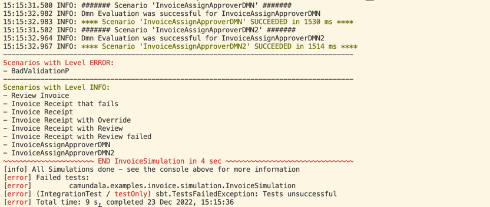
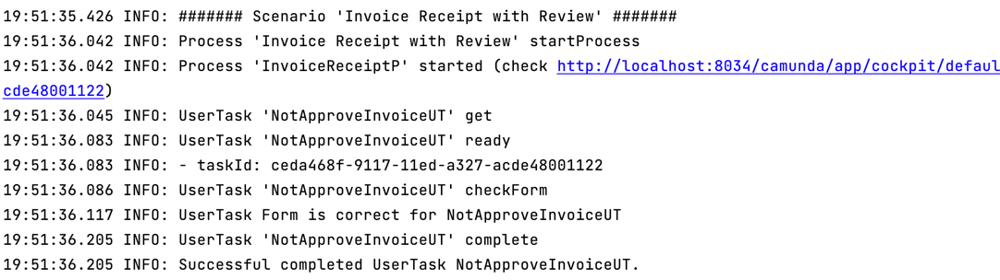
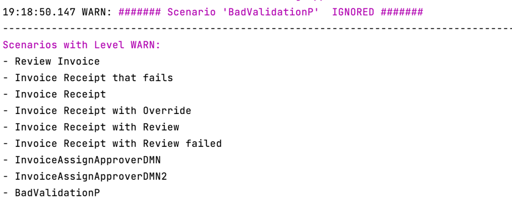

# Simulation

@:callout(warning)
For now this only works for **_Camunda 7_**.
@:@

Simulations let you run BPMNs and DMNs automatically on an installed Camunda 7 Platform. 
The diagrams must be deployed.

@:callout(info)
For the deployment I created a script that also starts the Simulation.
@:@

## Why
I like Simulations because:

- If there are problems, you easily can check the Camunda Cockpit.
- I think they are easy to maintain.
- The in- and outputs are exactly the API of the BPMNs.
- You can move to every part of your BPMN automatically, 
  for example to check a _UserTask_.
- It is great to develop test driven.
- With the heat map, you can check, if you tested already all paths.

Of course most of these points are also true for Unit- and/or Scenario tests.

@:callout(info)
I also experimented with Unit- and Scenario Tests, and it would also be possible. But for now I concentrate 
my time on Simulations. I also think you should only do one of them, due to the work involved.
@:@

## Get Started
Simulations use the BPMNs you created - in this context I refer 
to the [Bpmn DSL](../bpmnDsl.md)

Let's start with a basic example:
```scala
// put your simulations in the simulation package of your project
package camundala.examples.invoice.simulation
// import the projects bpmns (Processes, UserTasks etc.)
import camundala.examples.invoice.bpmn.*
// import Camundala simulation DSL - for now this is the one and only
import camundala.simulation.custom.CustomSimulation
// define a class that extends from a simulation DSL   
class InvoiceSimulation extends CustomSimulation:

  // the is one simulate - use curly brackets {}
  simulate {
    // add scenarios - no comma needed
    scenario(`Review Invoice`)(
      AssignReviewerUT,
      ReviewInvoiceUT
    )
    scenario(InvoiceAssignApproverDMN)
    incidentScenario(
      `Invoice Receipt that fails`,
      "Could not archive invoice..."
    )(
      ApproveInvoiceUT,
      PrepareBankTransferUT
    )
    // more scenarios  ..
  }
end InvoiceSimulation
```

#### simulate
This is the entry point for your Simulation. 
There is one Simulation per Simulation class (file). 
A Simulation contains one or more Scenarios.

#### scenario
A scenario consists of a BPMN process or a DMN decision.
Then in optional second brackets you can add steps that interact
with the process. For DMNs there won't be any.

### Run the Simulation
In your _sbt-console_:

- run all simulations: 

  `It/test`

- run some simulations:

  `It/testOnly *MySimulation`

  You can use any pattern, where `*` is wildcard for any characters.


This creates the following output:

...


#### Log Levels Colors
Depending on the log level, the most important delimiters are in color:

- **Error: Red**
- **Warning: Magenta** 
- **Info: Green**

#### Simulation succeed / failure
As soon as there is a log entry with the level ERROR, the Simulations fail and the failing
Simulations are listed.

#### Reference to Camunda Cockpit
Each Process Scenario will print a link to the according Process-Instance:

`15:15:32.926 INFO: Process 'ReviewInvoiceP' started (check http://localhost:8034/camunda/app/cockpit/default/#/process-instance/42f84722-82cc-11ed-b5c6-9e5abd655523)`

This is not available for a DMN Scenario.

## Simulation

### Naming
The DSL is using the names of your BPMN objects like Processes and UserTasks.
As these objects can be reused in different Scenarios and Steps, we take the name 
of the variable. 

```scala
  lazy val `Invoice Receipt with Review` =
    `Invoice Receipt`
      .withOut(InvoiceReceiptCheck(clarified = Some(true)))
  lazy val NotApproveInvoiceUT =
    ApproveInvoiceUT
            .withOut(ApproveInvoice(false))  
    ...
    scenario(`Invoice Receipt with Review`)(
      NotApproveInvoiceUT,
      subProcess(`Review Invoice`)(
        AssignReviewerUT,
        ReviewInvoiceUT // do clarify
      ),
      ApproveInvoiceUT, // now approve
      PrepareBankTransferUT
    )
    ...
```
In this example we have a ProcessScenario with the name _Invoice Receipt with Review_.
The first Step has the name _NotApproveInvoiceUT_.

@:callout(info)
Use descriptive variable names. 
If you use special characters, you need to use backticks, like:

```scala
lazy val `Invoice Receipt with Review` = ...
```
@:@

These names are then used in the output Log:



### Configuration
The following is the default configuration:
```scala
case class SimulationConfig[B](
       // define tenant if you have one
       tenantId: Option[String] = None,
       // the Camunda Port
       // there are Requests that wait until the process is ready - like getTask.
       // the Simulation waits 1 second between the Requests.
       // so with a timeout of 10 sec it will try 10 times (retryDuration = 1.second)
       maxCount: Int = 10,
       // REST endpoint of Camunda
       endpoint: String = "http://localhost:8080/engine-rest",
       // you can add authentication with this - default there is none.
       // see BasicSimulationDsl / OAuthSimulationDsl for examples
       authHeader: B => B = (b: B) => b,
       // the maximum LogLevel you want to print the LogEntries.
       logLevel: LogLevel = LogLevel.INFO
   )
```
You can easily override it in your Simulation:
```scala
  override implicit def config =
    super.config
      .withPort(8034)
      .withLogLevel(LogLevel.DEBUG)
```

## Scenarios
The following chapters explain the different scenario types:

### Process Scenarios
#### scenario
TODO

#### incidentScenario
TODO


#### badScenario
TODO


### DMN Scenario
_Camundala_ uses the [Evaluate Decision REST API](https://docs.camunda.org/manual/7.18/reference/rest/decision-definition/post-evaluate/)
from _Camunda_.

```scala
  simulate {
    scenario(InvoiceAssignApproverDMN)
  }
```
As this is a single request, all you need is to add your DMN description you did with the BPMN DSL.

See [Business Rule Tasks (Decision DMNs)]

The simulation does the following steps:

- Take the attributes from your input
- Call the evaluation service
- Validate the result with your output

**The Example:**

We have the following DMN definition (bpmn):
```scala
lazy val InvoiceAssignApproverDMN = collectEntries(
  decisionDefinitionKey = "invoice-assign-approver",
  in = SelectApproverGroup(),
  out = Seq(ApproverGroup.management),
  descr = "Decision Table on who must approve the Invoice.",
)
```
This uses the following Inputs and outputs (domain):
```scala
case class SelectApproverGroup(
                                      amount: Double = 30.0,
                                      invoiceCategory: InvoiceCategory = 
                                        InvoiceCategory.`Software License Costs`
                              )

@description("These Groups can approve the invoice.")
enum ApproverGroup derives Adt.PureEncoder, Adt.PureDecoder :
  case accounting, sales, management
```
- Running this will use the inputs `amount` and `invoiceCategory` for the evaluation.
- The result, a list of `ApproverGroup`s (_collectEntries_), will then be matched against our specified `ApproverGroup`s.

@:callout(info)
At time of writing, there is no replacement in **_Camunda 8_** for this.
@:@

### Ignore a Scenario
You can ignore a scenario by just prefix your Scenario with `ignore.`.

#### Examples:
```scala
  simulate {
    ignore.scenario(`Review Invoice`)(
      AssignReviewerUT,
      ReviewInvoiceUT
    )
    ignore.incidentScenario(
      `Invoice Receipt that fails`,
      "Could not archive invoice..."
    )(
      ApproveInvoiceUT,
      PrepareBankTransferUT
    )
    ignore.scenario(InvoiceAssignApproverDMN)
    ignore.badScenario(
      BadValidationP,
      500,
        "Validation Error: Input is not valid: DecodingFailure(Missing required field, List(DownField(creditor)))"
    )
  }
```
An ignored Scenario will create a Warning in the output Log, like this:



@:callout(info)
It is not possible to ignore the whole simulation at once.
@:@