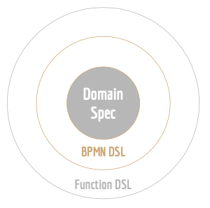
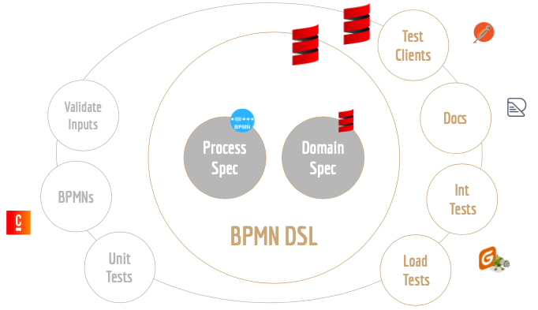

# Intro

@:callout()
_The main goal of **Camundala** is to use your **Domain** as much as possible in your **Process Automation**._

_Define the **Domain** and let **Camundala** do most of the rest._ 
@:@

@:callout(info)
I gave a talk at the _Camunda Community Summit 2022_ that covers the basics - well, the DSLs got a bit nicer since then😉. 
Check out here [Domain Driven Process Development](https://page.camunda.com/ccs2022-domaindrivenprocessdevelopment?hsLang=en)
@:@

## Why the Focus on the Domain?
### Common Language
_What have Users, Business Analysts and Developers in common?_

Right, they should know the Domain that they are using or providing.

To have a common domain prevents that each team has its own domain model and speaks a (slightly) different language.

### Vendor Independent
The Domain Model is specific to a Company and should not be coupled to a Software vendor 
or a BPMN-Provider in this case.

### Specifies the Process
A _Process_, but also for example a _User Task_, can be described via its inputs and outputs, 
which must of course reflect your _Domain_.

So from the outside all you need to know, is **_how_** to interact with your process. 
And this _**how**_ can we describe perfectly with domain objects. 

### Reusable
If for example you provide the domain objects for your processes, everyone can reuse them, 
when interacting with your processes or developing processes in the same domain.

## Design

The design consists of **three Layers**:

1. **Domain Specification**

   Defines your Domain that is needed to run the Process and interact with it. 

2. **BPMN DSL**
   
   Adds your Domain Model to concrete BPMN elements, like _Process_ or _User Task_.

   @:callout(info)
   DSL stays for Domain Specific Language.
   @:@

3. **Function DSLs**
 
   Different DSLs that add the functionality.
   We have the following DSLs at the moment:
   - **_api_**: Create a documentation from your Domain Models.
   - **_simulation_**: Run integration- and/ or load Tests with your Domain Models.
   
   There are more, but only in an experimental state:
   - _dmn_: Create the configurations for the DMN Tester.
   - _camunda_: Generate some of your Process Specification.

## Technology
@:callout(info)
We use _**Scala 3**_ for everything, except the Process Specification (BPMN).
@:@

* **Process Specification**
  
  This is standard _Camunda BPMN XML_.
* **Domain Specification**
  
  We describe the Domain with _Scala 3_. Here we use mainly:
    * Case Classes
    * Enums

  See [FP Domain Modeling](https://docs.scala-lang.org/scala3/book/taste-modeling.html#fp-domain-modeling)

* **BPMN- and Function DSLs**

  You can use a simple language to describe your BPMNs and Functionalities.
  Under the hood we use:

  _Scala’s features for DSL design: [curried functions](https://alvinalexander.com/scala/fp-book/partially-applied-functions-currying-in-scala/), [extension methods](https://docs.scala-lang.org/scala3/book/ca-extension-methods.html), symbolic method names and [scripting capability](https://scala-cli.virtuslab.org/). 
  Another great such feature new to Scala 3 is the [Context Function](https://docs.scala-lang.org/scala3/reference/contextual/context-functions.html#inner-main) type._   

  (from [Context Function for DSL Design in Scala](https://akmetiuk.com/posts/2022-04-02-context-functions.html))

## Getting Started
Just go throw the pages:

1. [Process & Domain Specification](specification.md)
2. [BPMN DSL](bpmnDsl.md)
3. [Functionality DSLs](functionalityDsls.md)