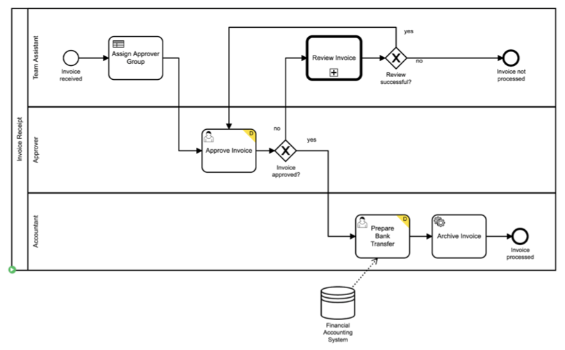

# Process & Domain Specification
First we define our Business Processes and -Domain.

## Process
Here we use the [BPMN Specification] with some extensions from [Camunda]. 
You can use [Camunda]'s tools to create them, see [Camunda Modeler](https://camunda.com/de/platform/modeler/).

To get started we will take the Invoice Example. 
You find a version for a version for _Camunda 7_ and one for _Camunda 8_ on Github - see [Invoice Example](https://github.com/pme123/camundala/tree/master/examples/invoice)

[Camunda 7 BPMN](https://github.com/pme123/camundala/blob/master/examples/invoice/camunda7/src/main/resources/invoice.v2.bpmn)


Nothing interesting here, just a standard Camunda/ BPMN Model. 
Let's define the Domain for this process.

## Domain
Whenever we interact with the _Process_, der are _Business Objects_ involved.
But also a Service that we integrate defines its _Domain_.

So implementing a Process is more or less working with Domain Objects, 
mostly mapping them to similar Domain Object, defined by Services.

To describe the _Domain Model_, we use basic _Scala_ constructs, like _Case Classes_ and _Enumerations_.

The following _BPMN Inputs / -Outputs_ do we describe:

* Process
* UserTask
* ReceiveSignal / ReceiveMessage (no Outputs)
* DMN

Here is the _UserTask_ 'Approve Invoice' from our _Invoice Process_.

* Import:
  ```scala
  import camundala.domain.*
  ```
* Input:
    ```scala
    @description("Received Invoice that need approval.")
    case class InvoiceReceipt(
      creditor: String = "Great Pizza for Everyone Inc.",
      amount: Double = 300.0,
      invoiceCategory: InvoiceCategory = InvoiceCategory.`Travel Expenses`,
      invoiceNumber: String = "I-12345",
      invoiceDocument: FileRefInOut = FileRefInOut(
        "invoice.pdf",
        "processes/invoice.pdf",
        Some("application/pdf")
      )
    )

    enum InvoiceCategory derives ConfiguredEnumCodec:
      case `Travel Expenses`, Misc, `Software License Costs`
    
    ```
* Output:
    ```scala
    @description("""Every Invoice has to be accepted by the Boss.""")
    case class ApproveInvoice(
       @description("If true, the Boss accepted the Invoice")
       approved: Boolean = true
    )
    
    ```

You see here the following elements:

* `@description("my descr")` Description of a class or a field > used then in the API Documentation.
* `creditor: String = "Great Pizza for Everyone Inc."` Define each field with a name, a type and an example.
  You can use:

    * simple types, like _String_, _Boolean_ etc.
    * enumerations - like `InvoiceCategory`
    * objects - just other _Case Classes_
* `invoiceDocument: FileRefInOut` in _Camunda 8_ only JSONs are allowed - so you need a File representation.
* `enum InvoiceCategory..` this is how you define an enumeration. `..derives ConfiguredEnumCodec..` is for JSON marshalling.
* `` `Travel Expenses`, `` if you have names with spaces you need to use Back-Ticks.

Checkout the whole Domain Description on [**Github**](https://github.com/pme123/camundala/blob/develop/examples/invoice/camunda8/src/main/scala/camundala/examples/invoice/domain.scala).

There are 2 things you have to care for that is not purely your domain.

### Case Class
You describe your domain model with case classes, 
as they are easy to create and there is support for documentation and JSON marshalling.

### Simple Enum
If an attribute of a Case Class is an enumeration you can use the Scala `enum`.

```scala
    enum InvoiceCategory derives ConfiguredEnumCodec:
      case `Travel Expenses`, Misc, `Software License Costs`
```

### Hierarchy Enum
If you have inputs or outputs that can differ, you can use the Scala `enum` as well. It just looks a bit different:

```scala
  enum GetCodesOut derives ConfiguredCodec:
    case KeyValues(
        codesResult: Option[Map[String, String]] = None,
        poBox: Option[Map[String, String]] = Some(defaultPoBoxFr)
    )

    case ManualKeys(
        codesResult: Option[Seq[Map[String, String]]] = None,
        poBox: Option[Seq[Map[String, Json]]] = Some(
          Seq(
            Map("key" -> 1.asJson, "name" -> "Postfach".asJson),
            ...
          )
        )
    )
  end GetCodesOut
```
### Generic Objects
Sometimes your domain is huge are you will start fast. 
To have still at least an example and correct test data, you can use a generic datatype, like `Json`.

This looks like this:
```scala
case class MyDomainClass(
  ... // some specific attributes
  someJson: Json = toJson("""{"value": 12}""")
)
```
You can create examples with `toJson("""{"value": 12}""")`.

This will be a Json Variable in the Simulations and you can use them everywhere in your domain model.

@:callout(info)
That this works you need this import: `import sttp.tapir.json.circe.*` - see [JSON marshalling].

**Tip**: Start with _Jsons_ and replace them with proper classes as soon you start documenting
(mostly when the process is stable).
@:@


### Documentation
The closer the documentation is to your code, that you work with, the higher is the chance that you will spot mistakes.
So we use `@description("my descr")` from _[Tapir](https://tapir.softwaremill.com/en/latest/index.html)_. 
These descriptions will then automatically taken into account when the API documentation is generated.

### JSON marshalling

@:callout(info)
We need this to get to and from JSON.
There is an automatic way, but it turned out that it made compiling slow.

Sorry for this technical noise 😥.
@:@

* Case Classes:
  ```scala
  given Schema[InvoiceReceipt] = Schema.derived
  given CirceCodec[InvoiceReceipt] = deriveCodec
 ```

* Enumeration:
  ```scala
  // ..derives ConfiguredCodec is needed for JSON marshalling of enums
  enum GetCodesOut derives ConfiguredCodec:
    ...
  given Schema[GetCodesOut] = Schema.derived
  
  // for simple enums:
  enum InvoiceCategory derives ConfiguredEnumCodec:
      case `Travel Expenses`, Misc, `Software License Costs`

  given Schema[InvoiceCategory] = Schema.derived
  ```

## Example

Here you find the Domain Specification of the Invoice example: [Invoice domain](https://github.com/pme123/camundala/blob/master/examples/invoice/camunda8/src/main/scala/camundala/examples/invoice/domain.scala)